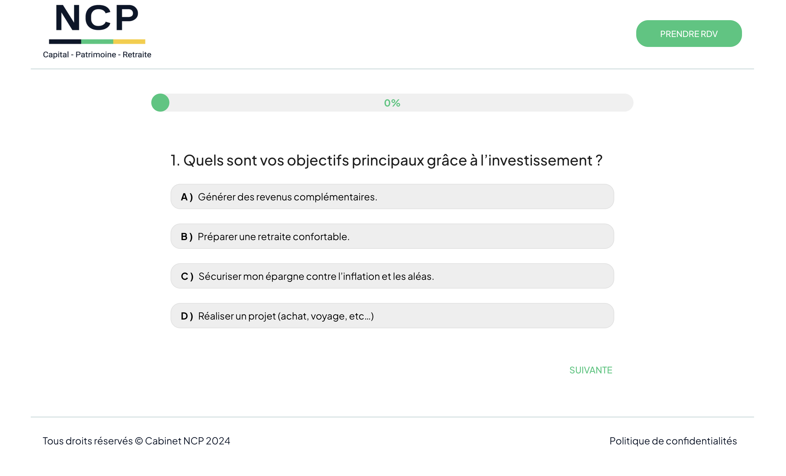

# Projet Landing page NCP

## Description
Questionnaire sur le niveau de connaissance en finance personnel avec proposition de rendez-vous pour un entretien personnalisé.

## Développement
### Prérequis
- Node.js
- npm
- Next.js
- Swiper.js
- Material-UI
- Calendy
- Google API

### To do list
#### Style
- [ ] changer la police pour les textes lato
- [ ] changer la police pour les titres Avenir standard
- [ ] changer la couleur des polices par le blue nuit #0c1629
- [x] ajuster le responsive du header comme sur la maquette
- [x] Diminuer les marges du questionnaire
- [x] Diminuer la marge entre la progressbar et la question
- [x] Ajouter de la marge entre la question et les réponses
- [x] Modifier la page de fin de questionnaire comme sur la maquette
- [x] Faire la page de prise de rendez-vous avec Calendy
- [x] ajouter un faut départ de la progressbar
- [x] la progressbar doit finir à 100% à la fin du questionnaire
- [ ] Ajouter message pour prévenir du de la double authentification de numéro et de l'email

#### Implémentation
- [x] Voir comment intégrer Calendy dans la page de prise de rendez-vous
- [x] Mettre en place la logique pour l'affichage de la page RDV si 2 réponses sont "d"
- [ ] Ajouter Double opt-in pour le numéro de téléphone
- [ ] Ajouter Double opt-in pour l'adresse mail

#### Google API
- [ ] Implémenter les système d'envoi de mail avec Google API
- [ ] Implémenter les système de remplissage du Google Sheet avec Google API

#### Déployement
- [x] Mettre en ligne le site sur Vercel
